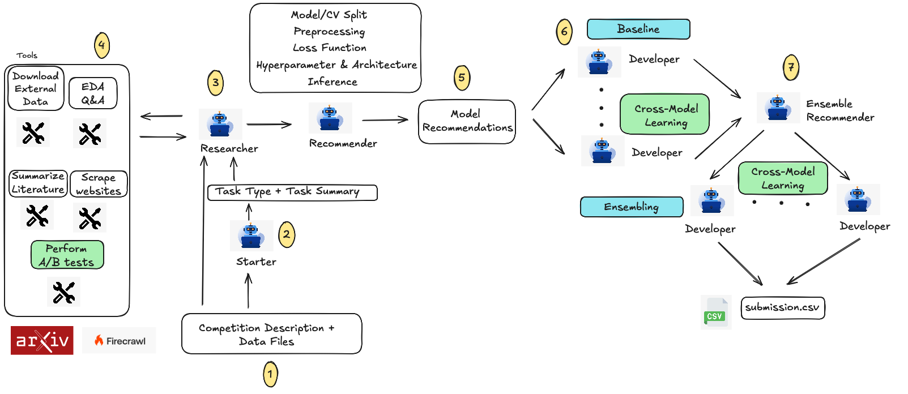

# Qgentic-AI

Qgentic-AI is a research & development automation stack aimed at iterating on Kaggle
competitions with minimal human intervention. Two collaborating LLM-driven agents – a
**Researcher** and a **Developer** – take a competition bundle, explore the data, produce a
technical plan, generate code, run it locally, analyse the results, and keep refining the
solution. Guardrails and supporting tools keep the loop grounded, reproducible, and safe.


---
## News

**[2025/11/23]** 📊 **Qgentic-AI achieves 0.68 Public LB for CSIRO-Biomass competition, placing it 20th/1400 teams (as of today) in the top 1.5%!**

**[2025/11/13]** 📊 **Qgentic-AI achieves 94.82% weighted mean percentile across 7 MLE-Bench competitions** - outperforming FM-Agent (93.91%), InternAgent (76.25%), MLE-STAR-PRO (72.74%), Operand (69.81%), and R&D-Agent (62.46%). Results reported as percentiles with 74:1 weighting to match MLE-Bench's 75-competition benchmark.

---

## Preliminary Results

## Present Competitions

| Kaggle Competition | LB score | Ranking | Notebook |
| --- | --- | --- | --- |
| csiro-biomass | 0.68 | Top 1.5% (20/1400) - Nov 23, 2025 | Released after deadline |
| playground-series-s5e11 | 0.92684 | Top 6% (40/700) - **Best Single Model Public Notebook** 🚀 - Nov 4, 2025 | [Notebook 1](https://www.kaggle.com/code/yeoyunsianggeremie/ps5e11-agentic-ai-solution-single-xgb) |
| playground-series-s5e10 | 0.05576 | Top 15% (606/4082) - Oct 31, 2025 | [Notebook 1](https://www.kaggle.com/code/yeoyunsianggeremie/ps5e10-agentic-ai-solution), [Notebook 2](https://www.kaggle.com/code/yeoyunsianggeremie/ps5e10-agentic-ai-xgb) |

## Past Competitions

The competitions were evaluated on 4x A100 80GB GPUs (splitted into 8 instances of 40GB using MIG). The average runtime is 8-9 hours per competition (1 hour researcher + 3 hours baseline + 4 hours ensemble + buffers).

Results are reported as **raw score (percentile%)** where percentile = % of leaderboard submissions beaten. The weighted mean uses a 74:1 ratio (weight 12.33 for each of 6 competitions, weight 1.0 for Statoil) to match MLE-Bench's 75-competition benchmark and prevent the Statoil outlier from dominating the overall metric.

**Note**: All results are based on commit [5b81ee0](https://github.com/bogoconic1/Qgentic-AI/commit/5b81ee06ffe393992a50090dcff180d91e698449).

| Kaggle Competition | Difficulty | Type | Metric | Qgentic-AI | FM Agent | InternAgent | Operand | R&D-Agent | MLE-STAR-PRO |
| --- | --- | --- | --- | --- | --- | --- | --- | --- | --- |
| us-patent-phrase-to-phrase-matching | Medium | Information Retrieval | PCC (higher) | 0.858<br>(74.01%) | 0.862<br>(90.26%) 🥉 | **0.868**<br>**(98.99%)** 🥈 | 0.692<br>(15.19%) | 0.801<br>(21.81%) | 0.753<br>(17.31%) |
| learning-agency-lab-automated-essay-scoring-2 | Medium | Text | QWK (higher) | **0.847**<br>**(100.00%)** 🥇 | **0.845**<br>**(100.00%)** 🥇 | 0.830<br>(63.18%) | 0.830<br>(64.40%) | 0.825<br>(46.90%) | 0.832<br>(68.91%) |
| tabular-playground-series-dec-2021 | Easy | Tabular | Accuracy % (higher) | **0.963**<br>**(100.00%)** 🥇 | **0.960**<br>**(100.00%)** 🥇 | **0.963**<br>**(100.00%)** 🥇 | **0.963**<br>**(100.00%)** 🥇 | **0.963**<br>**(100.00%)** 🥇 | **0.963**<br>**(100.00%)** 🥇 |
| statoil-iceberg-classifier-challenge | Medium | Image Classification | Logloss (lower) | **0.160**<br>**(83.18%)** | 1.258<br>(3.54%) | 0.203<br>(50.30%) | Failed<br>(0.00%) | Failed<br>(0.00%) | 0.246<br>(33.69%) |
| denoising-dirty-documents | Medium | Computer Vision | RMSE (lower) | **0.012**<br>**(98.15%)** 🥇 | 0.020<br>(93.21%) 🥈 | 0.023<br>(89.51%) 🥈 | 0.023<br>(89.51%) 🥈 | **0.011**<br>**(98.15%)** 🥇 | **0.011**<br>**(98.15%)** 🥇 |
| whale-categorization-playground | Medium | Computer Vision | MAP@5 (higher) | **0.557**<br>**(97.73%)** 🥇 | 0.466<br>(93.01%) 🥈 | 0.183<br>(10.40%) | 0.361<br>(60.11%) | 0.262<br>(14.37%) | 0.360<br>(60.11%) |
| google-quest-challenge | Medium | Text | Spearman Correlation (higher) | **0.445**<br>**(100.00%)** 🥇 | 0.394<br>(94.34%) 🥉 | 0.409<br>(97.52%) 🥈 | 0.398<br>(95.29%) 🥈 | 0.415<br>(98.60%) 🥈 | 0.396<br>(95.10%) 🥈 |
| **Weighted Mean Percentile** | | | | **94.82%**<br>(4🥇 1🥈 0🥉) | 93.91%<br>(2🥇 2🥈 2🥉) | 76.25%<br>(1🥇 3🥈 0🥉) | 69.81%<br>(1🥇 2🥈 0🥉) | 62.46%<br>(2🥇 1🥈 0🥉) | 72.74%<br>(2🥇 1🥈 0🥉) |
--- 

## Architecture at a Glance



---

## Getting Started

### 1. Prerequisites

- Python 3.12.
- CUDA-enabled GPU.

```
conda create --name qgentic-ai python=3.12 -y
conda activate qgentic-ai

git clone https://github.com/bogoconic1/Qgentic-AI.git
cd Qgentic-AI
pip install uv
bash install.sh
```

Add your ```kaggle.json``` file in the Qgentic-AI directory

If you want to download MLE-Bench Data for another competition, modify ```install.sh``` ```TASK_NAME``` and only execute ```prepare_data``` and ```copy_task_data```

### 2. Configure API Keys & Environment

Create a `.env` file in the project root (or export directly):

```
GOOGLE_API_KEY=...
OPENAI_API_KEY=...
ANTHROPIC_API_KEY=...
FIRECRAWL_API_KEY=...
HF_TOKEN=...
GOOGLE_CLOUD_PROJECT=...
GOOGLE_CLOUD_LOCATION=global
GOOGLE_GENAI_USE_VERTEXAI=True
KAGGLE_USERNAME=
KAGGLE_KEY=
```

These keys are loaded via `python-dotenv`. Adjust the environment variables listed in
`config.yaml` if you need custom names or endpoints.

### 3. Download Meta Kaggle from Kaggle Datasets
```
sudo apt-get install unzip
curl -L -o /workspace/meta-kaggle.zip https://www.kaggle.com/api/v1/datasets/download/kaggle/meta-kaggle

unzip meta-kaggle.zip -d /workspace/meta-kaggle
```

Then run
```
python create_metadata.py --competition-slug "enter slug"
```

You will see something like this

```
task/
└─ "enter slug"/
   ├─ description.md
   ├─ public_insights.md
   ├─ sample_submission.csv
   ├─ comp_metadata.yaml
   └─ train files/test files
```

### 4. Create Required Files

Before running the agent, create these files in `task/<slug>/`:

- **`cv_splits.json`**: Cross-validation fold indices for reproducible train/val splits
- **`metric.py`**: Competition-specific evaluation metric implementation

Optionally, configure Human-In-The-Loop (HITL) instructions in `config.yaml`:
- `researcher.hitl_instructions`: Guide research direction
- `model_recommender.hitl_models`: Override model selection with specific models
- `developer.hitl_instructions`: Guide code implementation

### 5. Launch an Iteration

```bash
python launch_agent.py --slug "enter slug" --iteration 1
```

Time limits are controlled via `config.yaml` (`runtime.baseline_time_limit`).

### 6. Monitoring & Artefacts

- `researcher.txt` / `developer.txt` capture detailed logs for each iteration.
- `code_{iteration}_v{version}.py` are the generated scripts; corresponding logs sit under
  `code_{iteration}_v{version}.txt`.
- Weights & Biases and Weave projects are initialised in `launch_agent.py`; supply
  `--wandb-entity/--wandb-project`, export `WANDB_ENTITY/WANDB_PROJECT`, or define them
  in `config.yaml` under `tracking.wandb`.

---

## Configuration

Key settings live in `config.yaml` (merged with `project_config.py` defaults):

- **llm**: Model configurations for different components:
  - `developer_model`: Main Developer agent code generation (`gpt-5`)
  - `developer_tool_model`: Developer tools - red flags, SOTA suggestions, debug (`gemini-3-pro-preview`)
  - `researcher_model`: Main Researcher agent planning (`claude-sonnet-4-5`)
  - `researcher_tool_offline_model`: EDA tool execution (`gemini-3-pro-preview`)
  - `researcher_tool_online_model`: External dataset search (`gemini-3-pro-preview`)
  - `starter_model`: Starter agent for initial exploration (`gemini-3-pro-preview`)
  - `model_recommender_model`: Model recommendation agent (`gemini-3-pro-preview`)
  - `model_selector_model`: Model selection (`gemini-3-pro-preview`)
  - `paper_summary_model`: Research paper summarization (`gemini-3-pro-preview`)
  - `ensembler_model`: Ensemble agent (`gemini-3-pro-preview`)
  - `leakage_review_model`: Data leakage guardrail (`gemini-3-pro-preview`)

- **runtime**: Execution parameters:
  - `baseline_time_limit`: Total time budget for baseline iteration in seconds (default: 432000 = 5 days)
  - `ensemble_time_limit`: Total time budget for ensemble iteration in seconds (default: 432000 = 5 days)
  - `baseline_code_timeout`: Timeout for baseline code execution in seconds (default: 43200 = 12 hours)
  - `ensemble_code_timeout`: Timeout for ensemble code execution in seconds (default: 43200 = 12 hours)
  - `ask_eda_max_attempts`: Max retry attempts for EDA/A/B test code generation (default: 5)
  - `download_datasets_max_attempts`: Max retry attempts per query phrasing for external dataset discovery (default: 1)
  - `researcher_max_steps`: Max steps for researcher exploration (default: 512)
  - `llm_max_retries`: Max retries for LLM calls (default: 3)
  - `directory_listing_max_files`: Max files shown in directory listings (default: 10)
  - `researcher_parallel_runs`: Number of parallel researcher runs (default: 1)
  - `baseline_max_parallel_workers`: Max parallel baseline workers when MIG disabled (default: 3)
  - `enable_mig`: Enable NVIDIA MIG GPU isolation (auto-detects worker count from available MIG instances)
  - `enable_multi_gpu`: Enable multi-GPU parallelism across physical GPUs (default: true)
  - `allowed_gpu_ids`: Restrict to specific GPU IDs; empty uses all detected GPUs (default: [])
  - `enable_cpu_affinity`: Enable CPU core pinning for parallel processes (default: true)
  - `reset_conda_envs_per_run`: Reset conda environments before each run (default: true)
  - `use_validation_score`: Use validation score from logs instead of MLE-bench grading (default: true)
  - `patch_mode_enabled`: Experimental diff-based workflow (default: false)

- **paths**: Root directories and naming templates for generated artifacts.

- **guardrails**: Security and quality checks before code execution:
  - `enable_code_safety`: LLM-based critical security check using Gemini 2.5 Flash (default: true)
  - `leakage_review`: LLM-based data leakage detection (default: true)
  - `logging_basicconfig_order`: AST-based logging order check (default: true)

- **researcher**: Researcher agent settings:
  - `hitl_instructions`: Human-In-The-Loop instructions list. If non-empty, these instructions are added to the researcher's system prompt to guide research direction (default: `[]`). Example: `["Focus on time-series cross-validation", "Analyze seasonality patterns", "Consider external weather data"]`

- **model_recommender**: Model recommendation settings:
  - `hitl_models`: Human-In-The-Loop model list. If non-empty, these models will be used instead of LLM-based dynamic selection (default: `[]`). Example: `["xgboost", "lightgbm", "deberta-v3-large"]`
  - `enable_web_search`: Enable web search for SOTA strategies (default: true)

- **developer**: Developer agent settings:
  - `hitl_instructions`: Human-In-The-Loop instructions list. If non-empty, these instructions are added to the developer's system prompt to guide code implementation (default: `[]`). Example: `["Use gradient clipping to prevent exploding gradients", "Implement mixed precision training", "Focus on domain-specific data augmentation"]`

> **Patch Mode** – The developer supports a token-efficient diff workflow. Toggle `runtime.patch_mode_enabled: true` to request unified diffs (with line numbers). DO NOTE this feature is unstable and can break!

> **Parallel Execution** – Supports flexible GPU configurations (Multi-GPU, Single-GPU, and MIG):
> - **MIG Mode** (`enable_mig: true`): Auto-detects available MIG instances and isolates each baseline to a dedicated GPU partition. H100 80GB supports up to 7 MIG instances (1g.10gb profile).
> - **Multi-GPU Mode** (`enable_multi_gpu: true`): Distributes baselines across multiple physical GPUs.
> - **Single-GPU Mode**: Sequential execution using `baseline_max_parallel_workers` to control concurrency.
> - Each baseline runs in an isolated conda environment (`qgentic-model-{idx}`) with dedicated CPU cores when `enable_cpu_affinity: true`.

---

# Sample Logs


---

## License

MIT
