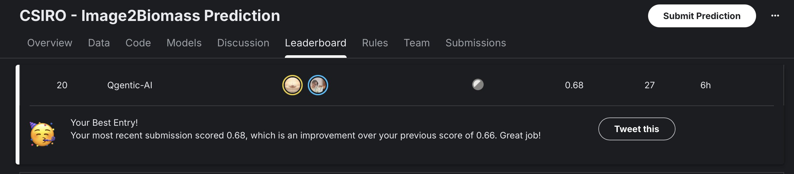
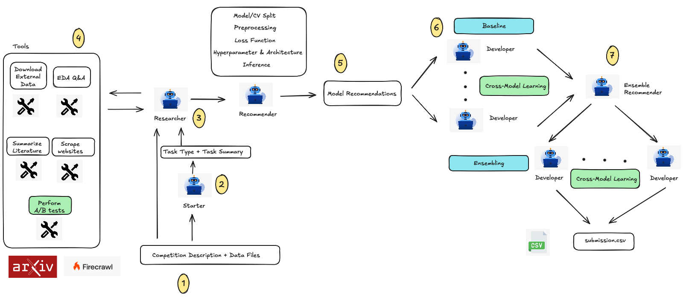

# Qgentic-AI

Qgentic-AI is a research & development automation stack aimed at iterating on Kaggle
competitions with minimal human intervention. Two collaborating LLM-driven agents – a
**Researcher** and a **Developer** – take a competition bundle, explore the data, produce a
technical plan, generate code, run it locally, analyse the results, and keep refining the
solution. Guardrails and supporting tools keep the loop grounded, reproducible, and safe.



---
## News

**[2025/11/23]** 📊 **Qgentic-AI achieves 0.68 Public LB for CSIRO-Biomass competition, placing it 20th/1400 teams (as of today) in the top 1.5%!**

**[2025/11/13]** 📊 **Qgentic-AI achieves 94.82% weighted mean percentile across 7 MLE-Bench competitions** - outperforming FM-Agent (93.91%), InternAgent (76.25%), MLE-STAR-PRO (72.74%), Operand (69.81%), and R&D-Agent (62.46%). Results reported as percentiles with 74:1 weighting to match MLE-Bench's 75-competition benchmark.

## Preliminary Results

## Present Competitions

| Kaggle Competition | LB score | Ranking | Notebook |
| --- | --- | --- | --- |
| csiro-biomass | 0.68 | Top 1.5% (20/1400) - Nov 23, 2025 | Released after deadline |
| playground-series-s5e11 | 0.92684 | Top 6% (40/700) - **Best Single Model Public Notebook** 🚀 - Nov 4, 2025 | [Notebook 1](https://www.kaggle.com/code/yeoyunsianggeremie/ps5e11-agentic-ai-solution-single-xgb) |
| playground-series-s5e10 | 0.05576 | Top 15% (606/4082) - Oct 31, 2025 | [Notebook 1](https://www.kaggle.com/code/yeoyunsianggeremie/ps5e10-agentic-ai-solution), [Notebook 2](https://www.kaggle.com/code/yeoyunsianggeremie/ps5e10-agentic-ai-xgb) |


## Past Competitions

The competitions were evaluated on 4x A100 80GB GPUs (splitted into 8 instances of 40GB using MIG). The average runtime is 8-9 hours per competition (1 hour researcher + 3 hours baseline + 4 hours ensemble + buffers).

Results are reported as **raw score (percentile%)** where percentile = % of leaderboard submissions beaten. The weighted mean uses a 74:1 ratio (weight 12.33 for each of 6 competitions, weight 1.0 for Statoil) to match MLE-Bench's 75-competition benchmark and prevent the Statoil outlier from dominating the overall metric.

**Note**: All results are based on commit [5b81ee0](https://github.com/bogoconic1/Qgentic-AI/commit/5b81ee06ffe393992a50090dcff180d91e698449).

| Kaggle Competition | Difficulty | Type | Metric | Qgentic-AI | FM Agent | InternAgent | Operand | R&D-Agent | MLE-STAR-PRO |
| --- | --- | --- | --- | --- | --- | --- | --- | --- | --- |
| us-patent-phrase-to-phrase-matching | Medium | Information Retrieval | PCC (higher) | 0.858<br>(74.01%) | 0.862<br>(90.26%) 🥉 | **0.868**<br>**(98.99%)** 🥈 | 0.692<br>(15.19%) | 0.801<br>(21.81%) | 0.753<br>(17.31%) |
| learning-agency-lab-automated-essay-scoring-2 | Medium | Text | QWK (higher) | **0.847**<br>**(100.00%)** 🥇 | **0.845**<br>**(100.00%)** 🥇 | 0.830<br>(63.18%) | 0.830<br>(64.40%) | 0.825<br>(46.90%) | 0.832<br>(68.91%) |
| tabular-playground-series-dec-2021 | Easy | Tabular | Accuracy % (higher) | **0.963**<br>**(100.00%)** 🥇 | **0.960**<br>**(100.00%)** 🥇 | **0.963**<br>**(100.00%)** 🥇 | **0.963**<br>**(100.00%)** 🥇 | **0.963**<br>**(100.00%)** 🥇 | **0.963**<br>**(100.00%)** 🥇 |
| statoil-iceberg-classifier-challenge | Medium | Image Classification | Logloss (lower) | **0.160**<br>**(83.18%)** | 1.258<br>(3.54%) | 0.203<br>(50.30%) | Failed<br>(0.00%) | Failed<br>(0.00%) | 0.246<br>(33.69%) |
| denoising-dirty-documents | Medium | Computer Vision | RMSE (lower) | **0.012**<br>**(98.15%)** 🥇 | 0.020<br>(93.21%) 🥈 | 0.023<br>(89.51%) 🥈 | 0.023<br>(89.51%) 🥈 | **0.011**<br>**(98.15%)** 🥇 | **0.011**<br>**(98.15%)** 🥇 |
| whale-categorization-playground | Medium | Computer Vision | MAP@5 (higher) | **0.557**<br>**(97.73%)** 🥇 | 0.466<br>(93.01%) 🥈 | 0.183<br>(10.40%) | 0.361<br>(60.11%) | 0.262<br>(14.37%) | 0.360<br>(60.11%) |
| google-quest-challenge | Medium | Text | Spearman Correlation (higher) | **0.445**<br>**(100.00%)** 🥇 | 0.394<br>(94.34%) 🥉 | 0.409<br>(97.52%) 🥈 | 0.398<br>(95.29%) 🥈 | 0.415<br>(98.60%) 🥈 | 0.396<br>(95.10%) 🥈 |
| **Weighted Mean Percentile** | | | | **94.82%**<br>(4🥇 1🥈 0🥉) | 93.91%<br>(2🥇 2🥈 2🥉) | 76.25%<br>(1🥇 3🥈 0🥉) | 69.81%<br>(1🥇 2🥈 0🥉) | 62.46%<br>(2🥇 1🥈 0🥉) | 72.74%<br>(2🥇 1🥈 0🥉) |
--- 

## Architecture at a Glance



# Sample Logs


## Getting Started

### 1. Prerequisites

- Python 3.12.
- CUDA-enabled GPU.

```
conda create --name qgentic-ai python=3.12 -y
conda activate qgentic-ai

git clone https://github.com/bogoconic1/Qgentic-AI.git
cd Qgentic-AI
pip install uv
bash install.sh
```

Add your ```kaggle.json``` file in the Qgentic-AI directory

If you want to download MLE-Bench Data for another competition, modify ```install.sh``` ```TASK_NAME``` and only execute ```prepare_data``` and ```copy_task_data```

### 2. Configure API Keys & Environment

Create a `.env` file in the project root (or export directly):

```
GOOGLE_API_KEY=...
OPENAI_API_KEY=...
ANTHROPIC_API_KEY=...
FIRECRAWL_API_KEY=...
HF_TOKEN=...
GOOGLE_CLOUD_PROJECT=...
GOOGLE_CLOUD_LOCATION=global
GOOGLE_GENAI_USE_VERTEXAI=True
KAGGLE_USERNAME=
KAGGLE_KEY=
```

These keys are loaded via `python-dotenv`. Adjust the environment variables listed in
`config.yaml` if you need custom names or endpoints.

### 3. Download Meta Kaggle from Kaggle Datasets
```
sudo apt-get install unzip
curl -L -o /workspace/meta-kaggle.zip https://www.kaggle.com/api/v1/datasets/download/kaggle/meta-kaggle

unzip meta-kaggle.zip -d /workspace/meta-kaggle
```

Then run
```
python create_metadata.py --competition-slug "enter slug"
```

You will see something like this

```
task/
└─ "enter slug"/
   ├─ description.md
   ├─ public_insights.md
   ├─ sample_submission.csv
   ├─ comp_metadata.yaml   
   └─ train files/test files
```

### 4. Launch an Iteration

```bash
python launch_agent.py --slug "enter slug" --iteration 1
```

Time limits are controlled via `config.yaml` (`runtime.baseline_time_limit`).

### 5. Monitoring & Artefacts

- `researcher.txt` / `developer.txt` capture detailed logs for each iteration.
- `code_{iteration}_v{version}.py` are the generated scripts; corresponding logs sit under
  `code_{iteration}_v{version}.txt`.
- Weights & Biases and Weave projects are initialised in `launch_agent.py`; supply
  `--wandb-entity/--wandb-project`, export `WANDB_ENTITY/WANDB_PROJECT`, or define them
  in `config.yaml` under `tracking.wandb`.

---

## Components

- **Starter Agent (`agents/starter.py`)**
  - Proposes 5 starter model ideas with short example code by referencing the competition description and `docs/state_of_competitions_2024.md`.
  - Persists `starter_suggestions.txt` and `starter_suggestions.json` in `task/<slug>/outputs/<iteration>/`.

- **Researcher Agent (`agents/researcher.py`)**
  - **Domain-First Discovery**: Implements mandatory Phase 0 (30-40 min budget) to deeply understand domain context before analysis:
    - Identifies real-world domain and stakeholders
    - Searches for dataset papers and domain literature using Gemini API with Google Search
    - Reads and summarizes research papers with `read_research_paper()` tool (powered by `PaperSummaryClient`)
    - Formulates 5-10 domain-specific hypotheses grounded in literature
    - Outputs structured domain context summary
  - **Hypothesis-Driven Exploration**: Tests domain-specific hypotheses with quantitative validation (correlations, distributions, A/B tests)
  - **Task-Specific Guides**: Provides tailored exploration strategies for tabular, NLP, computer vision, and time series tasks
  - **A/B Testing**: Runs controlled experiments comparing modeling approaches with automatic code generation and execution
  - **Research Paper Reading**: Integrates `PaperSummaryClient` with Google Search + URL Context tools to:
    - Find and read dataset papers via arXiv IDs
    - Search for model papers and technical documentation
    - Generate structured 6-section summaries (Abstract, Introduction, Related Work, Method/Architecture, Experiments/Results, Conclusion)
  - Tracks A/B test history (last 8 tests) to avoid redundant experiments and inform future tests
  - Self-critique loops ensure domain-specificity and reject generic approaches
  - Logs every step to `task/<slug>/outputs/<iteration>/researcher/`
  - Persists the final plan in `plan.md` – consumed verbatim by downstream stages

- **Model Recommender Agent (`agents/model_recommender.py`)**
  - Recommends up to 8 suitable models with detailed strategies for preprocessing, architecture, loss functions, hyperparameters, and inference.
  - **Multimodal Support**: For competitions with multiple data modalities (e.g., CV + tabular), recommends multi-stage pipelines where models work together (e.g., "EfficientNet (stage 1) + XGBoost (stage 2)").
  - Splits recommendations into NOW (MUST_HAVE) and LATER (NICE_TO_HAVE) categories for iterative development.
  - Supports fold split strategy recommendations and web search for SOTA techniques.

- **Developer Agent (`agents/developer.py`)**
  - Implements a two-stage approach for each iteration:
    1. **Stage 1 (Red Flags)**: Uses `search_red_flags()` with web search to identify issues in code/logs/submissions.
    2. **Stage 2 (SOTA Suggestions)**: Uses `search_sota_suggestions()` based on red flags to generate improvements.
  - Tracks global best score across all versions and provides detailed feedback:
    - Compares current score against the most recent non-blacklisted version
    - Shows previous score context in feedback messages: "Your score before implementing this suggestion was X"
    - Always updates global best regardless of base comparison (fixes first-version tracking)
  - Tracks both blacklisted ideas (failed strategies) and successful ideas (working strategies) for knowledge accumulation.
  - Supports dynamic resource allocation with CPU affinity and NVIDIA MIG GPU isolation for parallel execution.
  - Dynamic timeout: Code execution timeout automatically scales as `baseline_time_limit // 4` from config.
  - Each baseline run returns `(best_score, best_code_file, blacklisted_ideas, successful_ideas)`.
  - Results are merged into `baseline_results.json` with full metadata including recommendations and strategy outcomes.

- **Parallel Baseline Execution (`agents/orchestrator.py`)**
  - Launches multiple baseline `DeveloperAgent` runs concurrently using `ThreadPoolExecutor`.
  - **Dynamic Resource Allocation**: Uses Queue-based pools for CPU cores and MIG instances.
    - Processes grab resources when available and return them upon completion.
    - Prevents cyclic pre-assignment issues and resource contention.
  - **CPU Affinity**: Pins each process to specific CPU cores using `psutil` to prevent interference.
  - **NVIDIA MIG Support**: Auto-detects MIG instances and isolates each baseline to a dedicated GPU partition.
  - Configuration in `config.yaml`:
    - `enable_cpu_affinity`: Enable CPU core pinning
    - `enable_mig`: Enable MIG GPU isolation (auto-detects worker count from available MIG instances)
    - `baseline_max_parallel_workers`: Fallback worker count when MIG is disabled

- **Ensembling Agent (`agents/ensembler.py`)**
  - Combines multiple baseline models using diverse ensemble strategies (stacking, blending, weighted averaging, etc.).
  - Inherits from DeveloperAgent and follows the same two-stage flow (red flags + SOTA suggestions).
  - Operates in parallel with one agent per strategy for efficient exploration.
  - Multi-fold ensembling enabled by default for robust performance.
  - Uses ensemble-specific system prompts and naming conventions: `code_{iteration}_{strategy_index}_ens_v{version}.py`

- **Guardrails (`guardrails/`, `utils/guardrails.py`)**
  - **Code Safety Check** (`guardrails/code_safety.py`): LLM-based security analysis using Gemini 2.5 Flash
    - Blocks critical issues: `eval()`/`exec()`, command injection, hardcoded secrets
    - Explicitly allows: file operations, network requests, standard imports (lenient by design)
    - Returns structured output with decision, confidence, violations, and suggested fixes
  - **Data Leakage Review** (`guardrails/developer.py`): LLM-based train/test contamination detection
    - Detects: fit on combined data, test label usage, improper CV, time series leaks
    - Returns findings with rule IDs, code snippets, rationale, and suggested fixes
  - **Logging Order Check**: AST-based static analysis ensuring `logging.basicConfig()` precedes usage
  - All guardrails run before code execution; blocking decisions prevent unsafe code from running

- **Tools (`tools/`) & Shared Config (`project_config.py`)**
  - `tools.developer` wraps code execution, stack-trace web search, and SOTA suggestions:
    - `execute_code()`: Runs generated Python files with dynamic timeout (`baseline_time_limit // 4`)
    - `execute_code_with_oom_retry()`: Automatic OOM retry logic with configurable polling
    - `search_red_flags()`: Stage 1 red flag identification with web search
    - `search_sota_suggestions()`: Stage 2 SOTA improvements based on red flags and shared suggestions
  - `tools.researcher` exposes the EDA runtime, dataset downloader, and research paper reading:
    - `ask_eda()`: Execute exploratory data analysis code snippets
    - `download_datasets()`: Search and download external datasets
    - `read_research_paper()`: Read and summarize research papers via arXiv ID using Gemini API
  - `tools.generate_paper_summary` provides `PaperSummaryClient`:
    - Supports both arXiv paper IDs and model names
    - Uses Gemini API with Google Search + URL Context tools for paper discovery and reading
    - Generates structured 6-section summaries with domain-specific insights
    - Centralized retry logic via `call_llm_with_retry_google()` helper
  - `config.yaml` overrides project defaults (model endpoints, runtime limits, etc.).

- **Task Bundles (`task/<slug>/`)**
  - Expected layout: Kaggle metadata, `description.md`, `plan.md`, `outputs/<iteration>/`
    (logs, generated code, submissions), baseline artifacts (`baseline_results.json`),
    and per-baseline outputs under `outputs/<iteration>_<k>/`.
  - **Required user-defined files**:
    - `cv_splits.json`: Cross-validation fold indices for reproducible train/val splits
    - `metric.py`: Competition-specific evaluation metric implementation


---

## Configuration

Key settings live in `config.yaml` (merged with `project_config.py` defaults):

- **llm**: Model configurations for different components:
  - `developer_model`: Main Developer agent code generation (`gpt-5`)
  - `developer_tool_model`: Developer tools (red flags, SOTA suggestions, debug) (`gpt-5`)
  - `starter_model`: Starter agent for initial exploration (`gpt-5-mini`)
  - `model_recommender_model`: Model recommendation agent (`gpt-5-mini`)
  - `researcher_model`: Main Researcher agent planning (`gpt-5`)
  - `researcher_tool_offline_model`: EDA tool execution (`gpt-5`)
  - `researcher_tool_online_model`: External dataset search (`gpt-5`)
  - `leakage_review_model` / `leakage_followup_model`: Guardrails (`gpt-5-mini`)

- **runtime**: Execution parameters:
  - `baseline_time_limit`: Total time budget for baseline iteration in seconds (default: 10800 = 3 hours)
  - `ensemble_time_limit`: Total time budget for ensemble iteration in seconds (default: 14400 = 4 hours)
  - `baseline_code_timeout`: Timeout for baseline code execution in seconds (default: 5400 = 1.5 hours)
  - `ensemble_code_timeout`: Timeout for ensemble code execution in seconds (default: 10800 = 3 hours)
  - `ask_eda_max_attempts`: Max retry attempts for EDA/A/B test code generation (default: 5)
  - `download_datasets_max_attempts`: Max retry attempts per query phrasing for external dataset discovery (default: 1)
  - `researcher_max_steps`: Max steps for researcher exploration (default: 512)
  - `llm_max_retries`: Max retries for LLM calls (default: 3)
  - `baseline_max_parallel_workers`: Max parallel baseline workers when MIG disabled (default: 3)
  - `enable_mig`: Enable NVIDIA MIG GPU isolation (auto-detects worker count from available MIG instances)
  - `enable_multi_gpu`: Enable multi-GPU parallelism across physical GPUs (default: true)
  - `enable_cpu_affinity`: Enable CPU core pinning for parallel processes (default: true)
  - `reset_conda_envs_per_run`: Reset conda environments before each run (default: true)
  - `patch_mode_enabled`: Experimental diff-based workflow (default: false)

- **paths**: Root directories and naming templates for generated artifacts.

- **guardrails**: Security and quality checks before code execution:
  - `enable_code_safety`: LLM-based critical security check using Gemini 2.5 Flash (default: true)
  - `leakage_review`: LLM-based data leakage detection (default: true)
  - `logging_basicconfig_order`: AST-based logging order check (default: true)

- **researcher**: Researcher agent settings:
  - `hitl_instructions`: Human-In-The-Loop instructions list. If non-empty, these instructions are added to the researcher's system prompt to guide research direction (default: `[]`). Example: `["Focus on time-series cross-validation", "Analyze seasonality patterns", "Consider external weather data"]`

- **model_recommender**: Model recommendation settings:
  - `hitl_models`: Human-In-The-Loop model list. If non-empty, these models will be used instead of LLM-based dynamic selection (default: `[]`). Example: `["xgboost", "lightgbm", "deberta-v3-large"]`
  - `enable_web_search`: Enable web search for SOTA strategies (default: true)

- **developer**: Developer agent settings:
  - `hitl_instructions`: Human-In-The-Loop instructions list. If non-empty, these instructions are added to the developer's system prompt to guide code implementation (default: `[]`). Example: `["Use gradient clipping to prevent exploding gradients", "Implement mixed precision training", "Focus on domain-specific data augmentation"]`

> **Patch Mode (Experimental)** – The developer supports a token-efficient diff workflow.
> Toggle `runtime.patch_mode_enabled: true` to request unified diffs (with line numbers)
> from the model instead of full files. This feature is still being tuned.

> **Parallel Execution** – Supports flexible GPU configurations (Multi-GPU, Single-GPU, and MIG):
> - **MIG Mode** (`enable_mig: true`): Auto-detects available MIG instances and isolates each baseline to a dedicated GPU partition. H100 80GB supports up to 7 MIG instances (1g.10gb profile).
> - **Multi-GPU Mode** (`enable_multi_gpu: true`): Distributes baselines across multiple physical GPUs.
> - **Single-GPU Mode**: Sequential execution using `baseline_max_parallel_workers` to control concurrency.
> - Each baseline runs in an isolated conda environment (`qgentic-model-{idx}`) with dedicated CPU cores when `enable_cpu_affinity: true`.

---

## License

MIT
