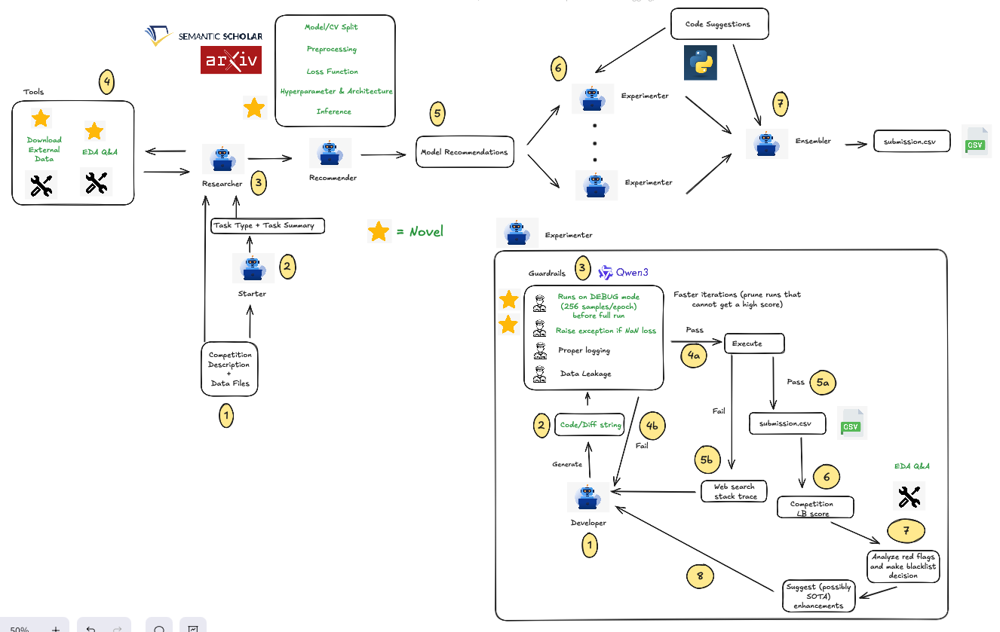

# Qgentic-AI

Qgentic-AI is a research & development automation stack aimed at iterating on Kaggle
competitions with minimal human intervention. Two collaborating LLM-driven agents – a
**Researcher** and a **Developer** – take a competition bundle, explore the data, produce a
technical plan, generate code, run it locally, analyse the results, and keep refining the
solution. Guardrails and supporting tools keep the loop grounded, reproducible, and safe.

---
## News

**[2025/11/04]** 🏆 **Qgentic-AI achieves #1 single-model public notebook on [PS5E11](https://www.kaggle.com/competitions/playground-series-s5e11)** (Top 6%, 40/700) with fully
  autonomous A/B testing!

**[2025/11/02]** Added Ensembling agent

**[2025/10/31]** Qgentic-AI supports flexible GPU configurations (Multi-GPU, Single-GPU, and MIG), automatically creating isolated conda environments for parallel model execution! You can execute up till 7x2 = 14 baseline model experiments in parallel on 2x A100 80GB GPUs! 🚀

**[2025/10/29]** Added thread-safe cross-model learning: parallel DeveloperAgent instances now share successful and failed suggestions in real-time, eliminating duplicate exploration and reducing wasted GPU compute. Suggestions include model attribution and score impact for intelligent pattern recognition.

**[2025/10/25]** Added first stage to identify red flags in code/logs/submission and CPU/GPU (NVIDIA MIG) parallelism support

**[2025/10/22]** Added ModelRecommender agent - recommend candidate models, preprocessing/architecture, etc

**[2025/10/17]** Updated evals for recent SOTA submissions to MLE-Bench repo. Chose competitions where the variation between the latest solutions are high.

**[2025/10/14]** Updated results of ongoing competition evaluation

## Preliminary Results

## Present Competitions

| Kaggle Competition | LB score | Ranking | Notebook |
| --- | --- | --- | --- |
| csiro-biomass | TBC | TBC | TBC |
| playground-series-s5e11 | 0.92684 | Top 6% (40/700) - **Best Single Model Public Notebook** 🚀 | [Notebook 1](https://www.kaggle.com/code/yeoyunsianggeremie/ps5e11-agentic-ai-solution-single-xgb) |
| playground-series-s5e10 | 0.05576 | Top 15% (606/4082) | [Notebook 1](https://www.kaggle.com/code/yeoyunsianggeremie/ps5e10-agentic-ai-solution), [Notebook 2](https://www.kaggle.com/code/yeoyunsianggeremie/ps5e10-agentic-ai-xgb) |


## Past Competitions

| Kaggle Competition | Difficulty | Type | Metric | Qgentic-AI (no ensembler) | FM Agent | InternAgent | Operand | R&D-Agent | MLE-STAR-PRO |
| --- | --- | --- | --- | --- | --- | --- | --- | --- | --- |
| us-patent-phrase-to-phrase-matching | Medium | Information Retrieval | PCC (higher) | 0.88072 | 0.86169 ± 0.01725 | 0.86793 ± 0.00294 | 0.69230 ± 0.20529 | 0.80092 ± 0.04586 | 0.75311 ± 0.14290 |
| learning-agency-lab-automated-essay-scoring-2 | Medium | Text | QWK (higher) | 0.84303 ± 0.00719 | 0.84471 ± 0.00549 | 0.82996 ± 0.00908 | 0.83013 | 0.82450 ± 0.01155 | 0.83171 ± 0.00660 |
| tabular-playground-series-dec-2021 | Easy | Tabular | Accuracy % (higher) | 0.96322 | 0.95988 ± 0.00158 | 0.96268 ± 0.00046 | 0.96266 ± 0.00071 | 0.96294 ± 0.00018 | 0.96267 ± 0.00059 |
| statoil-iceberg-classifier-challenge | Medium | Image Classification | Logloss (lower) | 0.19081 | 1.25837 ± 0.95314 | 0.20303 ± 0.00651 | Failed | Failed | 0.24558 ± 0.02098 |
| denoising-dirty-documents | Medium | Computer Vision | RMSE (lower) | TBC | 0.01958 ± 0.00749 | 0.02283 ± 0.01652 | 0.02301 ± 0.01474 | 0.01122 ± 0.00107 | 0.01145 ± 0.00059 |
| whale-categorization-playground | Medium | Computer Vision | MAP@5 (higher) | 0.42885 ± 0.04164 | 0.46635 ± 0.03608 | 0.18327 ± 0.14001 | 0.36061 ± 0.10255 | 0.26214 ± 0.01121 | 0.35985 ± 0.04825 |
| google-quest-challenge | Medium | Text | Spearman Correlation (higher) | TBC | 0.39365 ± 0.01830 | 0.40873 ± 0.01466 | 0.39802 ± 0.01202 | 0.41488 ± 0.00678 | 0.39628 ± 0.00535 |
--- 

## Architecture at a Glance



- **Starter Agent (`agents/starter.py`)**
  - Proposes 5 starter model ideas with short example code by referencing the competition description and `docs/state_of_competitions_2024.md`.
  - Persists `starter_suggestions.txt` and `starter_suggestions.json` in `task/<slug>/outputs/<iteration>/`.

- **Researcher Agent (`agents/researcher.py`)**
  - Uses tool-calling (EDA snippets, A/B testing, external dataset search) to understand the task.
  - **A/B Testing**: Runs controlled experiments comparing modeling approaches (e.g., different normalizations, augmentations, optimizers) with automatic code generation and execution.
  - Tracks A/B test history (last 8 tests) to avoid redundant experiments and inform future tests.
  - Logs every step to `task/<slug>/outputs/<iteration>/researcher/`.
  - Persists the final plan in `plan.md` – consumed verbatim by downstream stages.

- **Model Recommender Agent (`agents/model_recommender.py`)**
  - Recommends up to 8 suitable models with detailed strategies for preprocessing, architecture, loss functions, hyperparameters, and inference.
  - **Multimodal Support**: For competitions with multiple data modalities (e.g., CV + tabular), recommends multi-stage pipelines where models work together (e.g., "EfficientNet (stage 1) + XGBoost (stage 2)").
  - Splits recommendations into NOW (MUST_HAVE) and LATER (NICE_TO_HAVE) categories for iterative development.
  - Supports fold split strategy recommendations and web search for SOTA techniques.

- **Developer Agent (`agents/developer.py`)**
  - Implements a two-stage approach for each iteration:
    1. **Stage 1 (Red Flags)**: Uses `search_red_flags()` with web search to identify issues in code/logs/submissions.
    2. **Stage 2 (SOTA Suggestions)**: Uses `search_sota_suggestions()` based on red flags to generate improvements.
  - Tracks global best score across all versions and provides detailed feedback:
    - Compares current score against the most recent non-blacklisted version
    - Shows previous score context in feedback messages: "Your score before implementing this suggestion was X"
    - Always updates global best regardless of base comparison (fixes first-version tracking)
  - Tracks both blacklisted ideas (failed strategies) and successful ideas (working strategies) for knowledge accumulation.
  - Supports dynamic resource allocation with CPU affinity and NVIDIA MIG GPU isolation for parallel execution.
  - Dynamic timeout: Code execution timeout automatically scales as `baseline_time_limit // 4` from config.
  - Each baseline run returns `(best_score, best_code_file, blacklisted_ideas, successful_ideas)`.
  - Results are merged into `baseline_results.json` with full metadata including recommendations and strategy outcomes.

- **Parallel Baseline Execution (`agents/orchestrator.py`)**
  - Launches multiple baseline `DeveloperAgent` runs concurrently using `ThreadPoolExecutor`.
  - **Dynamic Resource Allocation**: Uses Queue-based pools for CPU cores and MIG instances.
    - Processes grab resources when available and return them upon completion.
    - Prevents cyclic pre-assignment issues and resource contention.
  - **CPU Affinity**: Pins each process to specific CPU cores using `psutil` to prevent interference.
  - **NVIDIA MIG Support**: Auto-detects MIG instances and isolates each baseline to a dedicated GPU partition.
  - Configuration in `config.yaml`:
    - `enable_cpu_affinity`: Enable CPU core pinning
    - `enable_mig`: Enable MIG GPU isolation (auto-detects worker count from available MIG instances)
    - `baseline_max_parallel_workers`: Fallback worker count when MIG is disabled

- **Ensembling Agent (`agents/ensembler.py`)**
  - Combines multiple baseline models using diverse ensemble strategies (stacking, blending, weighted averaging, etc.).
  - Inherits from DeveloperAgent and follows the same two-stage flow (red flags + SOTA suggestions).
  - Operates in parallel with one agent per strategy for efficient exploration.
  - Multi-fold ensembling enabled by default for robust performance.
  - Uses ensemble-specific system prompts and naming conventions: `code_{iteration}_{strategy_index}_ens_v{version}.py`

- **Guardrails (`guardrails/`), Tools (`tools/`) & Shared Config (`project_config.py`)**
  - `tools.developer` wraps code execution, stack-trace web search, and SOTA suggestions:
    - `execute_code()`: Runs generated Python files with dynamic timeout (`baseline_time_limit // 4`)
    - `execute_code_with_oom_retry()`: Automatic OOM retry logic with configurable polling
    - `search_red_flags()`: Stage 1 red flag identification with web search
    - `search_sota_suggestions()`: Stage 2 SOTA improvements based on red flags and shared suggestions
  - `tools.researcher` exposes the EDA runtime and dataset downloader.
  - `config.yaml` overrides project defaults (model endpoints, runtime limits, etc.).

- **Task Bundles (`task/<slug>/`)**
  - Expected layout: Kaggle metadata, `description.md`, `plan.md`, `outputs/<iteration>/`
    (logs, generated code, submissions), baseline artifacts (`baseline_results.json`),
    and per-baseline outputs under `outputs/<iteration>_<k>/`.

# Sample Logs


## Getting Started

### 1. Prerequisites

- Python 3.12.
- CUDA-enabled GPU.

```
conda create --name qgentic-ai python=3.12 -y
conda activate qgentic-ai

git clone https://github.com/bogoconic1/Qgentic-AI.git
cd Qgentic-AI
pip install uv
bash install.sh
```

Add your ```kaggle.json``` file in the Qgentic-AI directory

If you want to download MLE-Bench Data for another competition, modify ```install.sh``` ```TASK_NAME``` and only execute ```prepare_data``` and ```copy_task_data```

### 2. Install Dependencies

```bash
pip install vllm
```
This is an additional dependency not in requirements.txt, as running it together with others causes errors.

### 3. Configure API Keys & Environment

Create a `.env` file in the project root (or export directly):

```
GOOGLE_API_KEY=...
OPENAI_API_KEY=...
ANTHROPIC_API_KEY=...
EXA_API_KEY=...
OPENROUTER_API_KEY=...
E2B_API_KEY=...
FIRECRAWL_API_KEY=...
S2_API_KEY=...
HF_TOKEN=...
GOOGLE_CLOUD_PROJECT=...
GOOGLE_CLOUD_LOCATION=global
GOOGLE_GENAI_USE_VERTEXAI=True
```

These keys are loaded via `python-dotenv`. Adjust the environment variables listed in
`config.yaml` if you need custom names or endpoints.

### 4. Download Meta Kaggle from Kaggle Datasets
```
sudo apt-get install unzip
curl -L -o /workspace/meta-kaggle.zip https://www.kaggle.com/api/v1/datasets/download/kaggle/meta-kaggle

unzip meta-kaggle.zip -d /workspace/meta-kaggle
```

Then run
```
python create_metadata.py --competition-slug "enter slug"
```

You will see something like this

```
task/
└─ "enter slug"/
   ├─ description.md
   ├─ public_insights.md
   ├─ sample_submission.csv
   ├─ comp_metadata.yaml   
   └─ train files/test files
```

### 5. Launch an Iteration

```bash
python launch_agent.py --slug "enter slug" --iteration 1 --time-seconds $((6*3600))
```

### 6. Monitoring & Artefacts

- `researcher.txt` / `developer.txt` capture detailed logs for each iteration.
- `code_{iteration}_v{version}.py` are the generated scripts; corresponding logs sit under
  `code_{iteration}_v{version}.txt`.
- Weights & Biases and Weave projects are initialised in `launch_agent.py`; supply
  `--wandb-entity/--wandb-project`, export `WANDB_ENTITY/WANDB_PROJECT`, or define them
  in `config.yaml` under `tracking.wandb`.

---

## Configuration

Key settings live in `config.yaml` (merged with `project_config.py` defaults):

- **llm**: Model configurations for different components:
  - `developer_model`: Main Developer agent code generation (`gpt-5`)
  - `developer_tool_model`: Developer tools (red flags, SOTA suggestions, debug) (`gpt-5`)
  - `starter_model`: Starter agent for initial exploration (`gpt-5-mini`)
  - `model_recommender_model`: Model recommendation agent (`gpt-5-mini`)
  - `researcher_model`: Main Researcher agent planning (`gpt-5`)
  - `researcher_tool_offline_model`: EDA tool execution (`gpt-5`)
  - `researcher_tool_online_model`: External dataset search (`gpt-5`)
  - `leakage_review_model` / `leakage_followup_model`: Guardrails (`gpt-5-mini`)

- **runtime**: Execution parameters:
  - `baseline_time_limit`: Total time budget for baseline iteration in seconds (default: 21600 = 6 hours)
  - Code execution timeout automatically calculated as `baseline_time_limit // 4` (currently 5400s = 1.5 hours)
  - `ask_eda_max_attempts`: Max retry attempts for EDA/A/B test code generation (default: 3)
  - `download_datasets_max_attempts`: Max retry attempts per query phrasing for external dataset discovery (default: 1)
  - `researcher_max_steps`: Max steps for researcher exploration (default: 512)
  - `llm_max_retries`: Max retries for LLM calls (default: 3)
  - `baseline_max_parallel_workers`: Max parallel baseline workers when MIG disabled (default: 3)
  - `enable_mig`: Enable NVIDIA MIG GPU isolation (auto-detects worker count from available MIG instances)
  - `enable_multi_gpu`: Enable multi-GPU parallelism across physical GPUs (default: false)
  - `enable_cpu_affinity`: Enable CPU core pinning for parallel processes
  - `reset_conda_envs_per_run`: Reset conda environments before each run (default: false)
  - `patch_mode_enabled`: Experimental diff-based workflow (default: false)

- **paths**: Root directories and naming templates for generated artifacts.

- **guardrails**: Toggles for logging order checks, debug/NaN guard, and leakage reviews.

- **model_recommender**: Model recommendation settings:
  - `default_models`: Fallback model list (default: `["deberta-v3-large"]`)
  - `enable_web_search`: Enable web search for SOTA strategies (default: true)

> **Patch Mode (Experimental)** – The developer supports a token-efficient diff workflow.
> Toggle `runtime.patch_mode_enabled: true` to request unified diffs (with line numbers)
> from the model instead of full files. This feature is still being tuned.

> **Parallel Execution** – Supports flexible GPU configurations (Multi-GPU, Single-GPU, and MIG):
> - **MIG Mode** (`enable_mig: true`): Auto-detects available MIG instances and isolates each baseline to a dedicated GPU partition. H100 80GB supports up to 7 MIG instances (1g.10gb profile).
> - **Multi-GPU Mode** (`enable_multi_gpu: true`): Distributes baselines across multiple physical GPUs.
> - **Single-GPU Mode**: Sequential execution using `baseline_max_parallel_workers` to control concurrency.
> - Each baseline runs in an isolated conda environment (`qgentic-model-{idx}`) with dedicated CPU cores when `enable_cpu_affinity: true`.

---

## License

MIT
