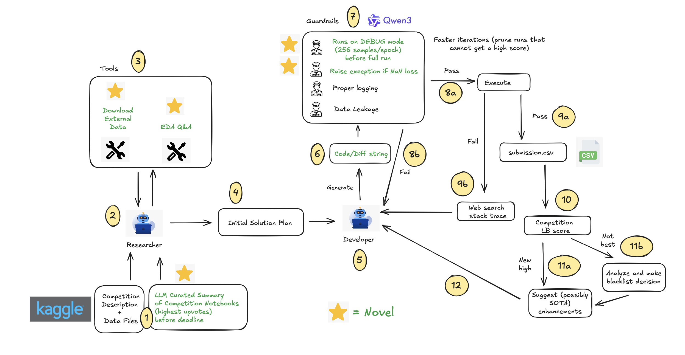
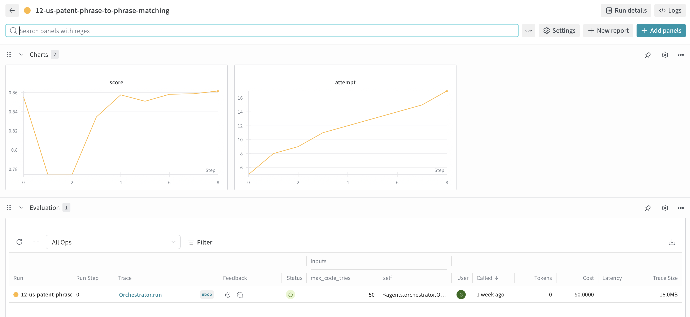

# Qgentic-AI

Qgentic-AI is a research & development automation stack aimed at iterating on Kaggle
competitions with minimal human intervention. Two collaborating LLM-driven agents – a
**Researcher** and a **Developer** – take a competition bundle, explore the data, produce a
technical plan, generate code, run it locally, analyse the results, and keep refining the
solution. Guardrails and supporting tools keep the loop grounded, reproducible, and safe.

---

## Results (Updated 2025/10/14)

## Present Competitions

| Kaggle Competition | Public LB score | Notebook |
| --- | --- | --- |
| playground-series-s5e10 | 0.05560 | [Here](https://www.kaggle.com/code/yeoyunsianggeremie/ps5e10-agentic-ai-solution) |

## Past Competitions

| Kaggle Competition | Difficulty | Type | Metric | AIDE with DeepSeek-R1 (extracted)<br>Average / Max | MLE-Star with Gemini-2.5-Pro (1 manual run)<br>- 24h time limit<br>Average / Max | Qgentic-AI with GPT-5<br>- 24h time limit<br>Average / Max |
| --- | --- | --- | --- | --- | --- | --- |
| us-patent-phrase-to-phrase-matching | Medium | Information Retrieval | PCC (higher) | 0.465 / 0.481 | 0.849 | **0.863 / 0.880** |
| learning-agency-lab-automated-essay-scoring-2 | Medium | Text | QWK (higher) | 0.733 / 0.748 | 0.797 | **0.828 / 0.840** |
| tabular-playground-series-dec-2021 | Easy | Tabular | Accuracy % (higher) | 0.9578 / 0.9612 | 0.9627 | 0.9611 / **0.9631** |
| statoil-iceberg-classifier-challenge | Medium | Image Classification | Logloss (lower) | 0.290 / 0.270 | 0.414 | **0.171 / 0.140** |
| denoising-dirty-documents | Medium | Computer Vision | RMSE (lower) | 0.1419/0.1326 | TBC | **0.01441** |
| leaf-classification | Easy | Image Classification | Logloss (lower) | 0.0761/0.0540 | TBC | **0.0218** |
| jigsaw-toxic-comment-classification-challenge | Easy | Text | AUC (higher) | 0.9752/0.9752 | TBC | **0.9848** |


--- 

## Architecture at a Glance



- **Researcher Agent (`agents/researcher.py`)**
  - Uses tool-calling (EDA snippets, external dataset search) to understand the task.
  - Logs every step to `task/<slug>/outputs/<iteration>/researcher.txt`.
  - Persists the final plan in `plan.md` – the Developer consumes this verbatim.

- **Developer Agent (`agents/developer.py`)**
  - Generates a single Python training script per attempt using OpenRouter models.
  - Executes the script, captures logs, scores the output, and iterates up to the
    configured maximum tries.
  - Guardrails enforce logging order, DEBUG→FULL sequencing, NaN detection, and optional
    leakage checks.
  - Integrates with Weave & Weights & Biases for observability.

- **Guardrails (`guardrails/`), Tools (`tools/`) & Shared Config (`project_config.py`)**
  - `tools.developer` wraps code execution, stack-trace web search, and SOTA suggestion
    lookups.
  - `tools.researcher` exposes the EDA runtime and dataset downloader.
  - `config.yaml` overrides project defaults (model endpoints, runtime limits, etc.).

- **Task Bundles (`task/<slug>/`)**
  - Expected layout: Kaggle metadata, `description.md`, `plan.md`, `outputs/<iteration>/`
    (logs, generated code, submissions), and optional external-data caches.

# Sample Logs



## Getting Started

### 1. Prerequisites

- Python 3.10+ (the development environment uses 3.11).
- Optional: CUDA-enabled GPU for training scripts that request GPU resources.

```
git clone https://github.com/bogoconic1/Qgentic-AI.git
cd Qgentic-AI
bash install.sh
```

Add your ```kaggle.json``` file in the Qgentic-AI directory

If you want to download MLE-Bench Data for another competition, modify ```install.sh``` ```TASK_NAME``` and only execute ```prepare_data``` and ```copy_task_data```

### 2. Install Dependencies

```bash
pip install vllm
```
This is an additional dependency not in requirements.txt, as running it together with others causes errors.

### 3. Configure API Keys & Environment

Create a `.env` file in the project root (or export directly):

```
GOOGLE_API_KEY=...
OPENAI_API_KEY=...
ANTHROPIC_API_KEY=...
EXA_API_KEY=...
OPENROUTER_API_KEY=...
E2B_API_KEY=...
```

These keys are loaded via `python-dotenv`. Adjust the environment variables listed in
`config.yaml` if you need custom names or endpoints.

### 4. Download Meta Kaggle and Meta Kaggle Code from Kaggle Datasets
```
sudo apt-get install unzip
curl -L -o /workspace/meta-kaggle.zip https://www.kaggle.com/api/v1/datasets/download/kaggle/meta-kaggle
curl -L -o /workspace/meta-kaggle-code.zip https://www.kaggle.com/api/v1/datasets/download/kaggle/meta-kaggle-code

unzip meta-kaggle.zip -d /workspace/meta-kaggle
unzip meta-kaggle-code.zip -d /workspace/meta-kaggle-code
```

Then run
```
python create_metadata.py --competition-slug "enter slug"
```

You will see something like this

```
task/
└─ "enter slug"/
   ├─ description.md
   ├─ public_insights.md
   ├─ sample_submission.csv
   ├─ comp_metadata.yaml   
   └─ train files/test files
```

### 5. Launch an Iteration

```bash
python launch_agent.py --slug "enter slug" --iteration 1 --tries 50
```

- The Researcher runs first (unless `plan.md` already exists for that iteration).
- The Developer then cycles through code generations, writing artifacts to
  `task/<slug>/outputs/<iteration>/`.
- `submission.csv` (or the configured `submission_{version}.csv`) is produced on success.

### 6. Monitoring & Artefacts

- `researcher.txt` / `developer.txt` capture detailed logs for each iteration.
- `code_{iteration}_v{version}.py` are the generated scripts; corresponding logs sit under
  `code_{iteration}_v{version}.txt`.
- Weights & Biases and Weave projects are initialised in `launch_agent.py`; supply
  `--wandb-entity/--wandb-project`, export `WANDB_ENTITY/WANDB_PROJECT`, or define them
  in `config.yaml` under `tracking.wandb`.

---

## Configuration

Key settings live in `config.yaml` (merged with `project_config.py` defaults):

- **llm**: base URL, API key env var, model IDs for Researcher/Developer and guardrails.
- **runtime**: max steps/tries, retry counts, directory listing depth, patch mode switch.
- **paths**: root directories and naming templates for generated artefacts.
- **guardrails**: toggles for logging order checks, debug/NaN guard, and leakage reviews.

> **Patch Mode (Experimental)** – The developer supports a token-efficient diff workflow.
> Toggle `runtime.patch_mode_enabled: true` to request unified diffs (with line numbers)
> from the model instead of full files. This feature is still being tuned

---

## License

MIT
