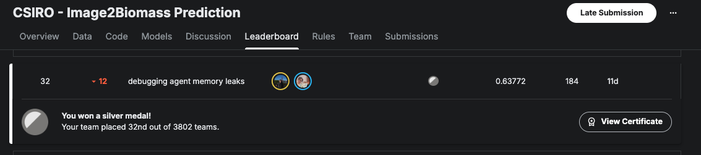

# Qgentic-AI

Qgentic-AI is an automated ML competition stack. Two LLM-driven agents -- a **Researcher** and a **Developer** -- take a competition bundle, explore the data, produce a technical plan, generate code, run it locally, analyse the results, and keep refining the solution.

## Problem Statement

> "If you can solve your own problem, it’s much more likely you’re solving the problem for others." - The engineers of Claude Code

I'm 2 golds away from Kaggle Competitions Grandmaster. A gold medal means finishing in the top ~1% against thousands of competitors -- many of whom are full-time ML engineers and PhD researchers dedicating weeks to a single competition. But working 6 days a week makes it extremely difficult to put together a top-notch solution. Gold-Medal performance usually requires **200+ hours of investment**.

Most of that time goes to repetitive "maintenance" tasks with diminishing educational value:
- Checking intermediate training results.
- Debugging crashed runs.
- Iterating endlessly on the same model family.
- Running endless evaluations.

A UCI study showed it takes ~23 minutes to regain focus after an interruption. Constantly context-switching between my job and my models was silently destroying my productivity.

This was how Qgentic-AI was born, with the goal of automating most of these mundane tasks, so that the amount of human effort to get a top solution reduces from 200+ hours to 20! Let the agent iterate on weekdays and I chime in on the weekends.

## Results



| Kaggle Competition | LB Score | Ranking |
| --- | --- | --- |
| csiro-biomass | **0.63772** | **Silver Medal Top 1% (32/3802)** |

---

## Getting Started

### 1. Prerequisites

- Python 3.12
- CUDA-enabled GPU

```
conda create --name qgentic-ai python=3.12 -y
conda activate qgentic-ai

git clone https://github.com/bogoconic1/Qgentic-AI.git
cd Qgentic-AI
pip install uv
bash install.sh
```

Add your `kaggle.json` file in the Qgentic-AI directory.

### 2. Configure API Keys

Create a `.env` file in the project root:

```
GOOGLE_API_KEY=...
OPENAI_API_KEY=...
ANTHROPIC_API_KEY=...
FIRECRAWL_API_KEY=...
HF_TOKEN=...
GOOGLE_CLOUD_PROJECT=...
GOOGLE_CLOUD_LOCATION=global
GOOGLE_GENAI_USE_VERTEXAI=True
KAGGLE_USERNAME=
KAGGLE_KEY=
```

### 3. Download Meta Kaggle

```
sudo apt-get install unzip
curl -L -o /workspace/meta-kaggle.zip https://www.kaggle.com/api/v1/datasets/download/kaggle/meta-kaggle
unzip meta-kaggle.zip -d /workspace/meta-kaggle
```

Then run:
```
python create_metadata.py --competition-slug "enter slug"
```

### 4. Create Required Files

Before running the agent, create these files in `task/<slug>/`:

- **`cv_splits.json`**: Cross-validation fold indices
- **`metric.py`**: Competition-specific evaluation metric

Optionally, add Human-In-The-Loop (HITL) instructions in `INSTRUCTIONS.md`:
- `# Researcher Instructions`: Guide research direction
- `# Models`: Override model selection
- `# Developer Instructions`: Guide code implementation

### 5. Launch

```bash
python launch_agent.py --slug "enter slug" --iteration 1
```

### 6. Monitoring

- `researcher.txt` / `developer.txt` capture detailed logs.
- `code_{iteration}_v{version}.py` are the generated scripts; logs sit under `code_{iteration}_v{version}.txt`.
- Weights & Biases tracking is configured via `config.yaml` under `tracking.wandb`.

---

## License

MIT
